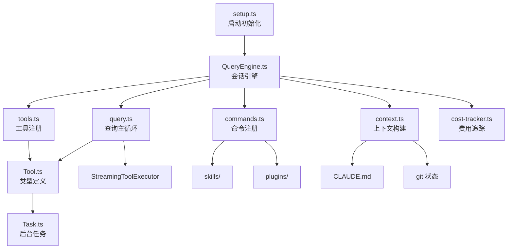

# Claude Code 核心架构分析

## 一、整体架构概览

```
                         用户输入 (CLI / SDK)
                              |
                          setup.ts
                     (环境初始化、worktree、hooks)
                              |
                        QueryEngine
                   (会话生命周期管理器)
                        /        \
                   context.ts    query.ts
                (系统/用户上下文)  (查询主循环)
                        \        /
                      Tool 系统 (Tool.ts)
                     /     |      \
               BashTool  FileEdit  AgentTool ...
                     \     |      /
                   tools.ts (工具注册表)
                              |
                   commands.ts (斜杠命令注册表)
                              |
                   cost-tracker.ts (费用与 token 统计)
```

## 二、核心模块详解

### 1. QueryEngine (QueryEngine.ts) — 会话引擎

QueryEngine 是整个系统的核心调度器，负责管理一次完整对话的生命周期。

**关键设计：**
- 一个 QueryEngine 实例对应一个会话（conversation）
- 每次 `submitMessage()` 调用代表一个新的对话轮次（turn）
- 状态（消息历史、文件缓存、token 用量）跨轮次持久化

**核心配置 `QueryEngineConfig`：**

| 字段 | 用途 |
|------|------|
| `cwd` | 工作目录 |
| `tools: Tools` | 可用工具列表 |
| `commands: Command[]` | 斜杠命令列表 |
| `mcpClients` | MCP 服务器连接 |
| `canUseTool` | 权限检查函数 |
| `maxTurns` / `maxBudgetUsd` | 轮次/预算限制 |
| `thinkingConfig` | 思考模式配置（adaptive/disabled） |
| `jsonSchema` | 结构化输出 schema |

**工作流程：**

```
submitMessage(prompt)
    |
    +---> 构建系统提示 (fetchSystemPromptParts)
    +---> 加载 CLAUDE.md 记忆文件
    +---> 包装 canUseTool（追踪权限拒绝）
    +---> 调用 query() 主循环
    +---> yield SDKMessage 流式输出
```

### 2. Tool.ts — 工具类型系统

Tool.ts 不是一个基类，而是一套**类型定义和上下文接口**。

**核心类型：**

```typescript
// 工具输入 schema（JSON Schema 格式）
type ToolInputJSONSchema = {
  type: 'object'
  properties?: { [x: string]: unknown }
}

// 工具使用上下文 — 传递给每个工具执行时的环境
type ToolUseContext = {
  options: {
    commands: Command[]
    tools: Tools
    mainLoopModel: string
    thinkingConfig: ThinkingConfig
    mcpClients: MCPServerConnection[]
    // ...
  }
  abortController: AbortController
  readFileState: FileStateCache
  getAppState(): AppState
  setAppState(f: (prev: AppState) => AppState): void
  messages: Message[]
  // ...
}

// 权限上下文
type ToolPermissionContext = DeepImmutable<{
  mode: PermissionMode          // 'default' | 其他模式
  alwaysAllowRules: ...         // 始终允许的规则
  alwaysDenyRules: ...          // 始终拒绝的规则
  additionalWorkingDirectories: Map<string, ...>
}>

// 工具验证结果
type ValidationResult =
  | { result: true }
  | { result: false; message: string; errorCode: number }
```

**`ToolUseContext` 是工具系统的核心纽带**，它将 AppState、文件缓存、消息历史、权限控制等全部注入到每个工具的执行环境中。

### 3. query.ts — 查询主循环

query.ts 实现了 LLM 交互的核心循环，是一个 **AsyncGenerator**。

**核心函数签名：**

```typescript
async function* query(params: QueryParams):
  AsyncGenerator<StreamEvent | Message | ...>
```

**QueryParams 关键字段：**

| 字段 | 用途 |
|------|------|
| `messages` | 消息历史 |
| `systemPrompt` | 系统提示 |
| `canUseTool` | 权限检查 |
| `toolUseContext` | 工具执行上下文 |
| `fallbackModel` | 备用模型 |
| `maxTurns` | 最大轮次 |
| `taskBudget` | API task_budget 控制 |

**循环内部状态 (`State`)：**

```typescript
type State = {
  messages: Message[]
  autoCompactTracking: ...      // 自动压缩追踪
  maxOutputTokensRecoveryCount  // max_output_tokens 恢复计数
  hasAttemptedReactiveCompact   // 是否尝试过响应式压缩
  turnCount: number             // 当前轮次
  pendingToolUseSummary: ...    // 待处理的工具摘要
}
```

**关键机制：**
- **自动压缩 (auto-compact)**：上下文过长时自动总结历史
- **响应式压缩 (reactive compact)**：prompt_too_long 错误时触发
- **max_output_tokens 恢复**：输出截断时自动重试（最多 3 次）
- **工具流式执行**：通过 `StreamingToolExecutor` 实现工具并行/流式调用

### 4. tools.ts — 工具注册表

tools.ts 是所有工具的**注册中心**，通过 `getAllBaseTools()` 返回完整工具列表。

**核心工具清单：**

| 工具 | 用途 |
|------|------|
| `BashTool` | 执行 shell 命令 |
| `FileReadTool` | 读文件 |
| `FileEditTool` | 编辑文件 |
| `FileWriteTool` | 写文件 |
| `GlobTool` | 文件搜索 |
| `GrepTool` | 内容搜索 |
| `AgentTool` | 子代理 |
| `SkillTool` | 技能调用 |
| `WebFetchTool` | 网页获取 |
| `WebSearchTool` | 网页搜索 |
| `TodoWriteTool` | 任务管理 |
| `NotebookEditTool` | Jupyter 编辑 |
| `ToolSearchTool` | 工具发现（延迟加载） |

**工具过滤机制：**

```
getAllBaseTools()              完整工具列表
    |
filterToolsByDenyRules()      按权限拒绝规则过滤
    |
getTools()                    按环境条件过滤（SIMPLE 模式、REPL 模式等）
```

**条件加载**：通过 `feature()` 和 `process.env` 实现工具的条件编译/加载（如 COORDINATOR_MODE、WORKFLOW_SCRIPTS 等）。

### 5. Task.ts — 后台任务系统

Task 系统管理后台异步任务（shell 命令、子代理等）。

**任务类型 (`TaskType`)：**

`local_bash` | `local_agent` | `remote_agent` | `in_process_teammate` | `local_workflow` | `monitor_mcp` | `dream`

**任务状态机：**

```
pending --> running --> completed
                   \-> failed
                   \-> killed
```

**核心接口：**

```typescript
type Task = {
  name: string
  type: TaskType
  kill(taskId: string, setAppState: SetAppState): Promise<void>
}

type TaskStateBase = {
  id: string              // 带类型前缀的唯一 ID（如 b/a/t/w...）
  type: TaskType
  status: TaskStatus
  description: string
  outputFile: string      // 磁盘输出文件路径
  outputOffset: number    // 读取偏移量
}
```

**ID 生成规则：** 类型前缀 + 8 位随机字符（36 进制），如 `b0x3k9m2p`。

### 6. commands.ts — 斜杠命令系统

commands.ts 注册所有 `/command` 斜杠命令，通过 `getCommands()` 返回。

**命令分类：**
- **会话管理**：`/clear`, `/compact`, `/resume`, `/session`
- **文件/代码**：`/diff`, `/files`, `/branch`, `/commit`
- **配置**：`/config`, `/permissions`, `/hooks`, `/model`
- **工具**：`/mcp`, `/skills`, `/agents`, `/plugin`
- **信息**：`/cost`, `/help`, `/status`, `/doctor`
- **内部专用**：`INTERNAL_ONLY_COMMANDS`（构建时移除）

命令支持通过 `getSkillDirCommands()`、`getPluginCommands()` 动态发现技能和插件命令。

### 7. context.ts — 上下文构建

提供两层上下文，在每次对话开始时注入：

| 函数 | 内容 | 缓存策略 |
|------|------|---------|
| `getSystemContext()` | git 状态（分支、最近提交、diff） | memoize |
| `getUserContext()` | CLAUDE.md 内容 + 当前日期 | memoize |

### 8. setup.ts — 启动初始化

`setup()` 函数在程序启动时执行，负责：

1. 检查 Node.js 版本 (>=18)
2. 设置工作目录 (`setCwd`)
3. 初始化 hooks 配置快照
4. 处理 worktree 创建（`--worktree` 模式）
5. 启动 UDS 消息服务器（进程间通信）
6. 初始化 Session Memory
7. 终端备份恢复（iTerm2、Terminal.app）

### 9. cost-tracker.ts — 费用追踪

负责追踪整个会话的 API 费用和 token 使用量。

**追踪维度：** 总费用、按模型费用、输入/输出 token、缓存读/写 token、API 耗时、代码变更行数。

**关键函数：**
- `addToTotalSessionCost()` — 累加一次 API 调用的费用
- `saveCurrentSessionCosts()` — 持久化到项目配置
- `restoreCostStateForSession()` — 恢复会话费用（用于 resume）

## 三、模块依赖关系



## 四、关键设计模式

1. **AsyncGenerator 流式架构**：`query()` 和 `submitMessage()` 均为 AsyncGenerator，实现流式输出和惰性求值
2. **条件编译 (Dead Code Elimination)**：通过 `feature()` 和 `bun:bundle` 在构建时移除未启用功能的代码
3. **权限分层**：`ToolPermissionContext` 支持 always-allow / always-deny / always-ask 三级规则
4. **memoize 缓存**：上下文构建函数使用 lodash memoize，避免重复 I/O
5. **依赖注入**：`ToolUseContext` 作为超级上下文对象，避免全局状态，支持子代理隔离
